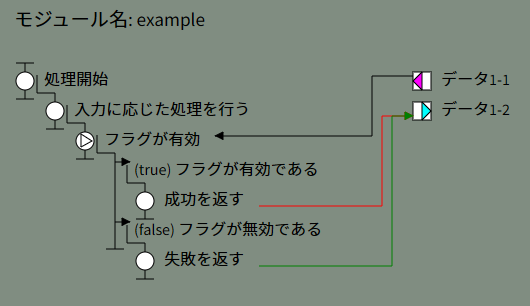
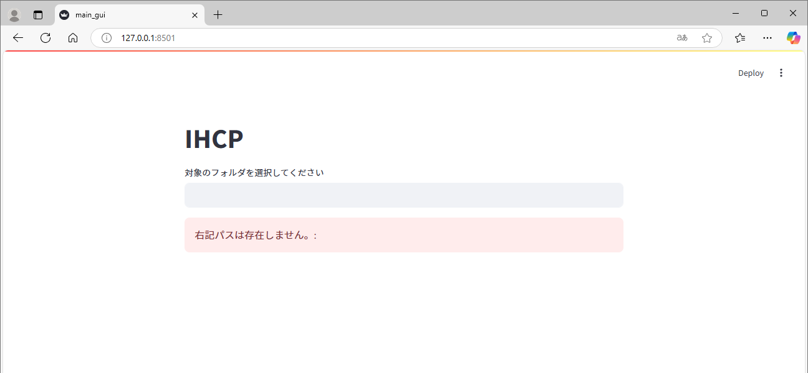
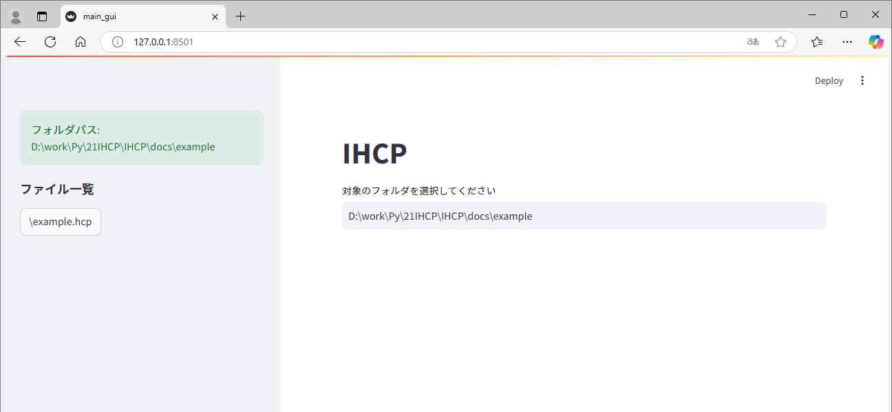
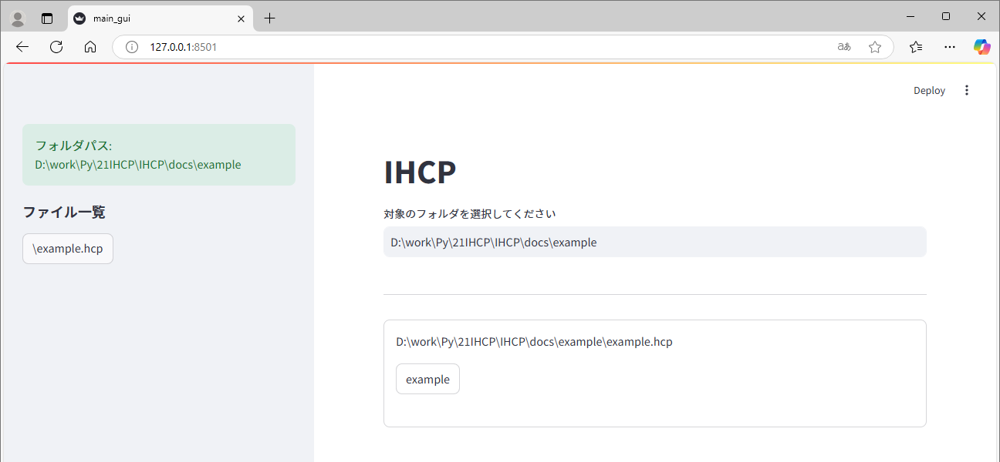
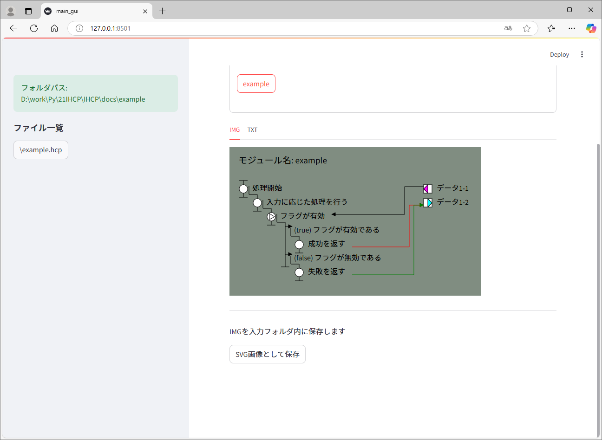
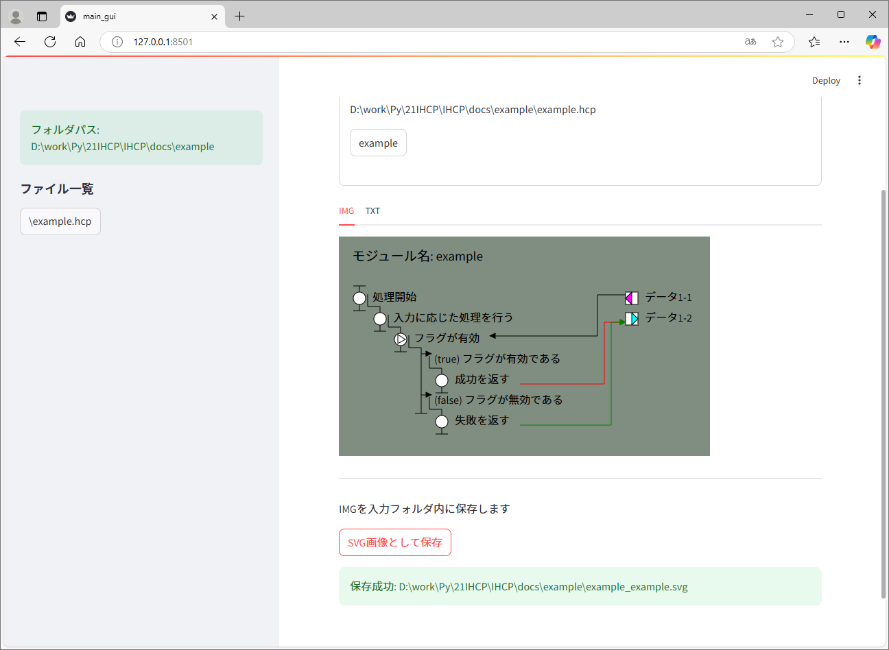

[](https://github.com/in0ho1no/IHCP/blob/main/LICENSE)
[](https://github.com/in0ho1no/IHCP/releases)
[](http://mypy-lang.org/)
[](https://github.com/astral-sh/ruff)

# IHCP

本ツールは、テキスト形式で記載されたHCPチャートを、SVG画像として描画する

## 実例

例えば、以下のような内容をexample.hcpファイルとして保存しておく。

```
\module example

\data データ1-1
\data データ1-2

処理開始 \in データ1-1 \out データ1-2
    入力に応じた処理を行う
        \fork フラグが有効 \in データ1-1
            \true フラグが有効である
                成功を返す \out データ1-2
            \false フラグが無効である
                失敗を返す \out データ1-2
```

本ツールにてexample.hcpファイルを読み込むと、下図のように描画される。



## 導入手順

本ツールを利用する準備手順を示す。

### 基本的な環境準備

まずは本ツールに限定しない基本的な環境を用意する。

1. 仮想環境を利用するため、uvをインストールする。
2. Pythonをインストールする。

#### uvをインストールする

Pythonパッケージ・プロジェクト管理ツールであるuvをインストールする。  
導入済みなら、この手順はスキップする。

[公式ページ](https://github.com/astral-sh/uv?tab=readme-ov-file#installation)
の手順に従い、以下コマンドを利用する。

```
powershell -ExecutionPolicy ByPass -c "irm https://astral.sh/uv/install.ps1 | iex
```

コマンドの意味は以下の通り。

- "powershell" : powershellを起動する。
- "-[ExecutionPolicy](https://learn.microsoft.com/ja-jp/powershell/module/microsoft.powershell.core/about/about_execution_policies?view=powershell-7.5#powershell-execution-policies) ByPass" : 信頼できる相手のスクリプトを実行するために実行ポリシーをBypassとする。
- "-c" : 以降の文字列をコマンドとして実行する。
- "irm \<URL\>" : "Invoke-RestMethod"の略。指定したURLからスクリプトをダウンロードする。
- "iex" : "Invoke-Expression"の略。パイプによって渡されたスクリプトを実行する。

以下コマンドを実行して、Pythonの有効なバージョンリストが表示されれば成功である。

```
uv python list
```

#### Pythonをインストールする

今回利用する3.13をインストール済みなら、この手順はスキップする。  
3.13を未インストールなら以下uvコマンドを利用してPythonをインストールする。

```
uv python install 3.13.2
```

### 本ツール用の環境準備

基本的な環境を整えたら、本ツールを利用する環境を用意する

1. 本ツールのプロジェクトをローカルにコピーする
2. 仮想環境を用意する

#### 本ツールのプロジェクトをローカルにコピーする

github上のreleaseページから、zipファイルをダウンロードする。

https://github.com/in0ho1no/IHCP/releases

#### 仮想環境を用意する

ダウンロードしたzipファイルを任意のフォルダへ解凍する。  
解凍したフォルダをコマンドプロンプト(端末・ターミナル)にて開き、以下コマンドを実行する。

```
uv sync
```

環境作成の成功を確認するために、以下コマンドを実行する。

```
uv pip show streamlit
```

以下のようにstreamlitのversion1.43.2に関する情報が表示されれば成功である。

    Name: streamlit
    Version: 1.43.2
    Location: <仮想環境を作成したパス>\.venv\Lib\site-packages
    Requires: altair, blinker, cachetools, click, gitpython, numpy, packaging, pandas, pillow, protobuf, pyarrow, pydeck, requests, tenacity, toml, tornado, typing-extensions, watchdog
    Required-by:

## 実行手順

以下ファイルをダブルクリックすることでguiを起動する。

    run_gui.bat

### 初回起動時

初回起動時は、メルマガの登録を促すメッセージが表示される。
不要であるため、何も入力せずにEnterを押下する。

    Welcome to Streamlit!

      If you’d like to receive helpful onboarding emails, news, offers, promotions,
      and the occasional swag, please enter your email address below. Otherwise,
      leave this field blank.

      Email:

初回起動時は、さらにプライバシーポリシーに関するメッセージが表示される。

    You can find our privacy policy at https://streamlit.io/privacy-policy

    Summary:
    - This open source library collects usage statistics.
    - We cannot see and do not store information contained inside Streamlit apps,
        such as text, charts, images, etc.
    - Telemetry data is stored in servers in the United States.
    - If you'd like to opt out, add the following to %userprofile%/.streamlit/config.toml,
        creating that file if necessary:

        [browser]
        gatherUsageStats = false


    You can now view your Streamlit app in your browser.

    URL: http://127.0.0.1:8501

同時にブラウザでGUIが表示されるので、本ツールを利用可能となる。

### 2回目以降の起動時

run_gui.batをダブルクリックして2回目以降に起動したときは、以下メッセージのみの表示となる。  

    You can now view your Streamlit app in your browser.

    URL: http://127.0.0.1:8501

## 操作手順

起動時のGUIは以下表示となる。  
画面中央の入力欄へ、".hcp"ファイルの格納されたフォルダパスを入力する。



入力したフォルダパスに問題がなければ、サイドバーにそのパスとファイル一覧が表示される。  
任意のファイル名をクリックする。



選択したファイルに問題がなければ、画面中央にモジュール一覧が表示される。  
任意のモジュール名をクリックする。  



選択したモジュールに問題がなければ、画面中央にHCPの画像が表示される。  
IMG/TXTのタブをクリックすれば、画像とテキストの表示を切り替えることができる。  



ページ下部のボタンをクリックすれば、画像を保存することができる。  
保存先は、".hcp"ファイルと同じフォルダ内である。  



## 対応している表記

HCPの記法に基づいてインデント(空白4つ∪タブ)でレベルを表現

### レベル0に記載できる表記

表記 | 内容 | 注意点
---| --- | ---
\module | モジュールの開始 | モジュール名とセットで必ず記載すること。

### レベル1以上に記載できる表記

表記 | 内容 | 注意点
---| --- | ---
\data | モジュール内で利用するデータの定義 | 重複
\fork | 条件分岐 | -
\true | 条件分岐の条件が真の場合 | \branchでもよい
\false | 条件分岐の条件が偽の場合 | \branchでもよい
\branch | 条件分岐の条件が真偽以外の場合 | -
\repeat | 繰り返し | -
\mod | 関数呼び出し | -
\return | 処理の終了 | 関数の出口・繰り返し・caseの終了等に用いる

### レベル1以上に追加で記載できる表記

表記 | 内容 | 注意点
---| --- | ---
\in | 処理・関数への入力 | レベル1へ記載した場合、関数への入力として扱う。レベル2以上へ記載した場合、単なる処理の入力として扱う。
\out | 処理・関数からの出力 | レベル1へ記載した場合、関数からの出力として扱う。レベル2以上へ記載した場合、単なる処理の出力として扱う。

## 注意点

### 文字コードの混在

UTF-8で書かれたテキストファイルをSJISで保存すると、文字コードが混在する。  
ファイル読み込み時のエラーになるので、どちらか一方に統一して記述すること。  
